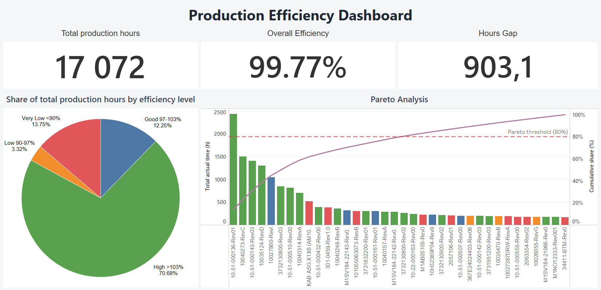

# Production Efficiency & Pareto Analysis

## Goal

The goal of this project is to identify products with the highest impact on production time and evaluate their efficiency using Pareto Analysis.

## Business Problem

In manufacturing, some products have a greater impact on total production workload than others. Identifying high-impact products helps prioritize improvement activities and focus on areas with the highest operational value.

## Objective

This analysis aims to:

* identify products with the highest impact on total production time,
* evaluate production efficiency by product,
* analyze the distribution of production time among key products,
* support decision-making for process improvement initiatives.

## Dataset

The dataset contains production data with the following information:

* Product
* Actual Time
* Standard Time
* Efficiency %

**Note:** The original dataset contained approximately 200 products. Products representing the first 50% of cumulative production time were selected for detailed analysis. This approach allowed the project to focus on the most operationally significant products while keeping the dashboard clear and readable.

## Business Questions

* Which products consume the most production time?
* What is the efficiency level of each product?
* Which products have the greatest impact on production workload?
* How is production time distributed among the selected high-impact products?
* Which products should be prioritized for process improvement?

## Methodology

The analysis was performed in SQL and included:

1. Filtering invalid efficiency values.
2. Aggregating production time by product.
3. Calculating:
   * weighted efficiency,
   * share of total production time,
   * cumulative share of production time,
   * net hours balance.
4. Selecting products representing the first 50% of cumulative production time.
5. Applying Pareto Analysis to the selected product group.
6. Creating an interactive Tableau dashboard.

## Production Efficiency Dashboard

An interactive Tableau dashboard was created to visualize:

* total production hours,
* efficiency vs standard,
* net hours balance,
* production time by efficiency level,
* Pareto chart,
* cumulative share of production time.

Click the image below to open the interactive Tableau dashboard.

## Key Findings
1. The selected group of 36 products generated 17,072 hours of actual production time.
2. Overall efficiency vs standard reached 103.7%, which means that the analyzed products were completed faster than the standard time.
3. The analyzed products achieved a positive net hours balance of +632 hours compared to the standard production time.
4. 71% of total production hours in the selected product group were generated by products with efficiency above 103%.
5. The analysis helped identify products with the highest impact on production workload and supported prioritization of areas for further process improvement.

## Tools Used
 * SQL
 * Tableau
 * GitHub
